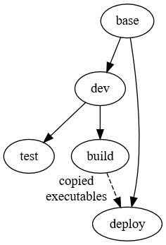

# Docker Stages for a C++ Project #
Most of my programming is in C++ and I use Docker for all of my development. So I've been interested in a good
[multistage build](https://docs.docker.com/develop/develop-images/multistage-build/) to assist in development, testing,
and deployment. Most examples on multistage builds don't use compiled languages, so they typically only have a few
stages that cover the entire development cycle. I've typically found this approach is not sufficient for C++. So I
decided to set up my own template.

In thinking through how this template should work, there were a number of requirements I identified:

* Most projects will have some number of dependencies that must be available at each stage
* Some of these dependencies may need built from source code
* There are a number of tools needed during development that aren't required for deployment (such as debuggers)
* The final deployed image should only have the compiled binaries and dependencies
* Different stages will have different build types (i.e. Release vs Debug)
* There should be very few, if any, duplicated RUN commands in the Dockerfile

Given that list, I developed the setup shown in the image below. Solid lines between stages indicate a direct dependency
(i.e. `FROM stage1 AS stage2`) The dashed line indicates a copy of files from one stage to the next.



To better illustrate this, I also put together the example project found
[at this GitHub repository](https://github.com/kylerobots/docker-cpp-stages). In addition to the Docker files, it
contains a trivial application and associated unit tests that depends on [GTSAM](https://gtsam.org/). It builds GTSAM
from source to target specific versions.

Let's go through each stage to discuss its purpose.

## Base Stage ##
The base stage is for any installable dependencies. Most projects have at least one or two packages that need
`apt install`. These should all go in the *base* stage. Since every subsequent stage is based on it, these dependencies
will always be available. Note that build-from-source dependencies do not go here, to keep the source code out of any
deployed image. Below is the *base* stage from the example project.

```dockerfile
FROM ${OS} AS base
RUN apt update \
  && DEBIAN_FRONTEND=noninteractive apt install -y --no-install-recommends \
  libboost-all-dev \
  libtbb-dev \
  && rm -rf /var/lib/apt/lists/*
```

In this particular case, the only project dependency is GTSAM. However, since it will be built from source, any of
GTSAM's dependencies must be installed at this stage. Additionally, to keep the image size small, the apt cache is
deleted after everything is installed,
[per best practices](https://docs.docker.com/develop/develop-images/dockerfile_best-practices/#run)

## Dev Stage ##
This is the stage used during development. Consequently, it will install all the tools needed for development but that
aren't required for deployment. This includes things like the compiler and debugging tools. This is also where any
build-from-source dependencies are cloned, compiled, and installed. As an example, see below.

```dockerfile
FROM base AS dev
RUN apt-get update \
  && DEBIAN_FRONTEND=noninteractive apt-get -y install --no-install-recommends \
  apt-transport-https \
  build-essential \
  ca-certificates \
  cmake \
  doxygen \
  gdb \
  git \
  && rm -rf /var/lib/apt/lists/*
WORKDIR /opt
ARG GTSAM_VERSION=develop
RUN git clone --branch ${GTSAM_VERSION} --depth 1 https://github.com/borglab/gtsam.git \
  && cmake -S gtsam -B gtsam/build \
  # See https://github.com/borglab/gtsam/blob/develop/INSTALL.md for details
  -DCMAKE_BUILD_TYPE=Debug \
  -DGTSAM_BUILD_CONVENIENCE_LIBRARIES:OPTION=OFF \
  -DGTSAM_BUILD_UNSTABLE:OPTION=OFF \
  && cmake --build gtsam/build --target install \
  && ldconfig
WORKDIR /root
CMD [ "bash" ]
```

In this example, those development tools are first installed. Then come the commands to clone GTSAM and build it. Use of
an ARG allows selection of a specific version of GTSAM without changing the Dockerfile. This can be helpful in automated
testing to ensure compatibility across a range of versions. When building GTSAM, there are also a number of CMake
configuration flags to customize the setup. Most notably is the specification of Debug mode for the build type. Since
this stage is used for active development, this build type is more useful than Release mode.

## Test Stage ##
The test stage is set up to allow automated CI testing. It doesn't care about image size or build type. So all it does
is just copy all the source code in and compile, like shown below.

```dockerfile
FROM dev AS test
COPY . /opt/docker_cpp_stages
WORKDIR /opt/docker_cpp_stages/build
RUN cmake -S /opt/docker_cpp_stages -B /opt/docker_cpp_stages/build \
  && cmake --build .
CMD [ "ctest", "-VV" ]
```

By setting the WORKDIR and CMD as shown, it will run the tests by default when using `docker run`, making it very easy
to check tests.

## Build Stage ##
This stage is an intermediate stage that prepares everything to copy into the final deploy stage. The main goal is to
compile the project and any build-from-source dependencies for Release. However, the dependencies were already installed
in the dev stage when built for Debug. Those dependencies must first be uninstalled, otherwise the final image will
contain both the Debug and Release versions of any dependencies.

```dockerfile
FROM dev AS build
COPY . /opt/docker_cpp_stages
WORKDIR /opt/docker_cpp_stages/build
RUN xargs rm -rf < /opt/gtsam/build/install_manifest.txt \
  && cmake -S /opt/gtsam -B /opt/gtsam/build -DCMAKE_BUILD_TYPE=Release \
  && cmake --build /opt/gtsam/build --target install
RUN cmake -S /opt/docker_cpp_stages -B /opt/docker_cpp_stages/build -DCMAKE_BUILD_TYPE=Release -DBUILD_TESTING=OFF \
  && cmake --build /opt/docker_cpp_stages/build --target install
CMD [ "bash" ]
```

The above example uninstalls GTSAM from the image, recompiles it for Release, then reinstalls it. It then copies in the
source code of the project and compiles for Release as well. Note the flag to avoid performing any test related items in
CMake. This is optional, but presumably the test code should not be in the image.

## Deploy Stage ##
This "final" stage is the one that is shipped out. It is based off the base image so that all of the development-only
dependencies are not included. Since the build stage already compiled everything, this stage only copies those
binaries into the image. It also sets up a non-root user,
[per best practices](https://docs.docker.com/develop/develop-images/dockerfile_best-practices/#user). The end result of
building this stage is an image almost identical to the base image, just with the installed binaries and a new user. The
default command can then be set to whatever default command is used in the project. An example is below.

```dockerfile
FROM base AS deploy
# Copy any locally install code
COPY --from=build /usr/local/ /usr/local/
RUN ldconfig
# Make a local user to avoid admin
RUN useradd -ms /bin/bash user
USER user
WORKDIR /home/user
CMD [ "main" ]
```

Using this example, running `docker images` shows the size of each stage's images, as shown in the table below. The base
image and deploy image are very similar in size, as is expected. By comparison, the test stage, which contains the
source code and development tools, is significantly larger.

| Stage  | Size    |
| ------ | ------- |
| base   | 826 MB  |
| test   | 5.47 GB |
| deploy | 841 MB  |

Exploring the file structure in the image also confirms that only the compiled binaries are new.

## Wrap Up ##
This setup provides a template for C++ projects or other compiled language projects that have unique requirements at
each point in development. It provides development stages with all the tools needed to effectively create and test the
project. It also provides a deployment stage that contains only the minimum build artifacts necessary to run the
project, without the source code or other extras brought in for development. While this multistage template is more
complicated than a single stage with manual changes, it only takes a brief setup at the beginning of the project and
everything else is automated from there.

The code used in this example is found [at this repository](https://github.com/kylerobots/docker-cpp-stages). If you
have suggestions for how to further improve this setup, please let me know!